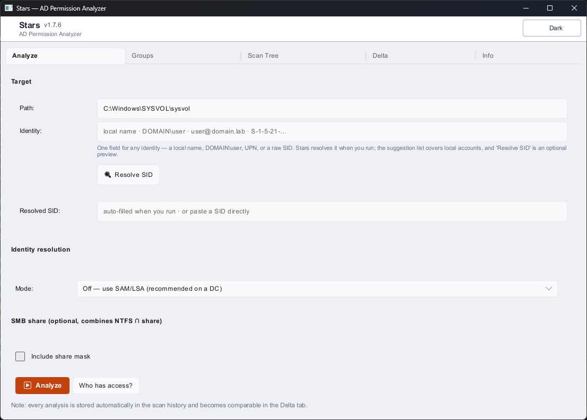
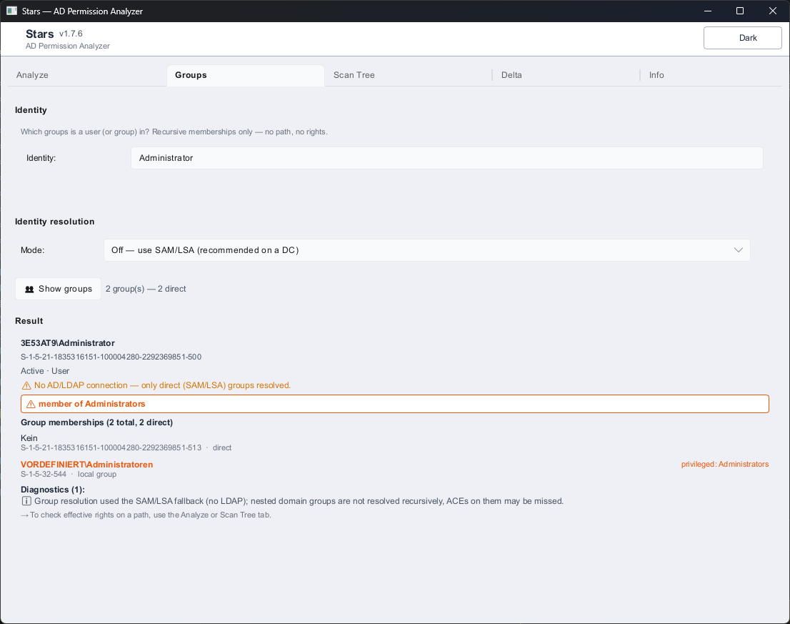

# Stars — AD Permission Analyzer

[](https://github.com/Birgerson/stars-ad-permission-analyzer/releases)
[](https://github.com/Birgerson/stars-ad-permission-analyzer/actions/workflows/ci.yml)

[](https://github.com/Birgerson/stars-ad-permission-analyzer/releases)
[](https://birgerson.github.io/stars-ad-permission-analyzer/)
[](docs/user-guide.md)
[](#verify-integrity-sha256)

---

**Stars** is a Windows analysis tool for Active Directory permissions, NTFS access rights, and SMB shares.

For every user, the tool shows the effective access rights that actually apply to folders and files — and above all **how** those rights come about: through which groups, which ACL entries, which inheritance.

> **Stars is exclusively a read-and-analyze tool. It does not modify any permissions, groups, or AD objects.**



## Contents

- [](#overview) — what Stars does, rights labels, when to use it, privacy
- [](#download--install) — installer, integrity check, antivirus note
- [](#what-stars-is) — background, scope, and what it analyzes
- [](#using-stars) — GUI tabs, identity input, CLI, and limits
- [](#documentation) — guides, technical docs, limits, audit criteria, ADRs
- [](#project--development) — structure, build, data, and support
- [](#legal) — disclaimer and license

---

## Overview

### Concrete example in 10 seconds

For every path Stars answers **"what does the user have, and why"** — with the full permission chain:

```text
User max.mustermann -> member of "Sales"
                    -> member of "FileServer_Read"
                    -> Allow ACE [inherited] for FileServer_Read
                    -> NTFS: Read & Execute
                    -> Share permission: Change
                    -> Effective (NTFS ∩ Share): Read & Execute
```

You get this step-by-step chain — including diagnostic markers when something is uncertain — in the GUI, in the CSV/JSON/HTML report, and in the CLI output. For 1 path or 5000 paths alike.

### Rights labels — what `F`, `RX`, `RW` mean

Stars shows each effective right as a long form plus a short label, e.g. `Read & Execute (RX)`. The short labels are **identical to Windows `icacls`**, so they read the same as in the tools you already use:

| Short | Long form | Meaning |
|---|---|---|
| `F` | Full Control | everything, including changing the ACL (`WRITE_DAC`) and taking ownership (`WRITE_OWNER`) |
| `M` | Modify | read + write + delete, but **not** ACL or owner changes |
| `RX` | Read & Execute | read, list, and run executables |
| `RW` | Read & Write | read + write, **without** the execute right |
| `R` | Read | read only |
| `W` | Write | write only |
| `(special)` | Special | a partial / custom access mask that matches none of the above — inspect the raw mask (`0x…`) |

Stars always reports the **highest** matching level (precedence `F > M > RX > RW > R > W > (special)`); a higher level implies the lower ones (Full Control implies Modify, which implies Read & Execute, …). The full per-bit detail is preserved in the raw mask shown next to the label. See the [user guide](docs/user-guide.md#rights-labels--what-f-rx-rw-mean) for the same table with context.

### Can Stars help you? — 30-second overview

> **Full overview:** [](docs/can-stars-help-you.md) — when Stars fits and when another tool is better.

**✅ Stars is the right tool when you need to:**

- explain **why** a user has exactly this effective permission on a folder / share (full path: identity → group → mediator → ACE → aggregation)
- understand how NTFS and SMB share permissions combine (the more restrictive mask wins — Stars computes this correctly)
- handle nested AD groups, local server groups (`BUILTIN\…`), Deny ACEs, and protected inheritance
- use a tool that changes **nothing** in AD, NTFS, or SMB — not even “just to fix it”
- snapshot a directory tree (e.g. 5000 folders) as CSV / JSON / HTML

**❌ Stars is *not* the right tool for:**

| Need | Use instead |
|---|---|
| Active remediation, ACL cleanup, owner change | your preferred ACL management tool |
| Continuous auditing, event stream, logon tracking | ManageEngine ADAudit Plus / SIEM |
| AD security score, forest hardening assessment | PingCastle, Purple Knight |
| Attack-path analysis from an attacker’s perspective | BloodHound CE |
| Access governance, recertification, workflows | SolarWinds ARM, Netwrix, Quest, Lepide |
| Broad AD inventory reports (GPOs, trusts, sites) | ADRecon |

**Three hard limits Stars will never cross:**

1. **Read-only.** No release will ever ship write functions for NTFS / SMB / AD.
2. **No agent** on target systems. Stars runs on an audit workstation or audit DC.
3. **No backdoor auth.** Stars binds via LDAP (ideally LDAPS), nothing else.

### Privacy and data flow

Stars is a **local tool**. Concretely:

- **No telemetry, no phone-home.** Stars never contacts an external server, neither during install nor while running.
- **No network connections beyond the targets you explicitly enter** — i.e. LDAP/LDAPS to the DC you configure, plus SMB to the servers whose shares you analyze. Nothing else.
- **No auto-update.** The update mechanic is architecturally prepared but currently inactive — Stars makes no connection to an update server.
- **No crash reports to third parties.** If Stars crashes, the error stays in the local log file (see below).

This makes Stars suitable for isolated audit environments and air-gapped networks.

## Download & install

### Download

Get the current Windows installer from the **[Releases page](https://github.com/Birgerson/stars-ad-permission-analyzer/releases)**.

1. Click the latest release at the top of the list.
2. Download `Stars-vX.Y.Z-Setup.exe` **and** `Stars-vX.Y.Z-Setup.exe.sha256` from *Assets*.
3. **Recommended:** verify integrity (see below) — Stars currently has no code-signing certificate.
4. Double-click the installer — no administrator rights required. A **Stars** icon appears on the desktop.

System requirements: Windows 10, Windows 11, or Windows Server. No additional runtime needed.

> ⚠️ **Antivirus false positive (every unsigned release, incl. v1.7.6).** Because the installer is **not yet code-signed**, Microsoft Defender — and some other engines — may flag it with a **generic, machine-learning heuristic** such as `Trojan:Win32/Wacatac.C!ml`. The `!ml` suffix means "flagged by an ML model," **not** a match against known malware; `Wacatac` is Defender's catch-all label and is the single most common false positive for new, unsigned, freshly-compiled binaries. It is triggered by the combination of *unsigned + zero reputation + AD/SMB enumeration behaviour* — exactly what a read-only permission auditor legitimately does.
>
> **This is a false positive, and you can prove it yourself:** verify the SHA256 (see below) against the `Stars-vX.Y.Z-Setup.exe.sha256` published next to the installer on the release page. A matching hash means the file is bit-for-bit the build GitHub Actions produced from this public source — by definition nothing could have been injected.
>
> To remove the warning: verify the hash, then allow the file in Defender (Protection history → the entry → Allow), and optionally report it to Microsoft at <https://www.microsoft.com/en-us/wdsi/filesubmission>. The permanent fix is code signing — see [`docs/codesigning.md`](docs/codesigning.md).

#### Verify integrity (SHA256)

So you can confirm your download is bit-for-bit identical to the build produced by GitHub Actions:

```powershell
$exe = "Stars-v1.7.6-Setup.exe"  # adapt to your version
$expected = (Get-Content "$exe.sha256").Split("  ")[0]
$actual   = (Get-FileHash $exe -Algorithm SHA256).Hash.ToLower()
if ($actual -eq $expected) { "OK — file matches" } else { "MISMATCH — do NOT use" }
```

On WSL / Linux / macOS, `sha256sum -c Stars-v1.7.6-Setup.exe.sha256` works directly.

> **What the hash file gives you — and what it doesn't:** The hash protects against tampered downloads (mirror modification, MITM). It does **not** replace code signing — you verify the authenticity of the source through the GitHub repo itself, not through the hash. Code signing is planned; see [`docs/codesigning.md`](docs/codesigning.md) for status.

> **Tested platforms:** Stars is verified against **Windows Server 2022 Standard** and **Windows Server 2025 Standard** (3-forest lab, 1000 test users, 5000 directories).
>
> **Use at your own risk. Make a full backup before any production use.** → [Full disclaimer](#disclaimer)

## What Stars is

### How Stars came to be

Stars was built by a certified IT Specialist for Application Development who delegated the implementation to Claude (Anthropic) as a tool — under full control of every architecture decision, every review, and every correction.

The result: a production-grade audit tool, verified in a 3-forest lab against 1000 test users and 5000 paths.

Treating AI as an amplifier of your own craft, not a replacement, gets you to software that holds its promises faster.

### What is Stars?

Stars is a **native Windows application** (`.exe`) for IT administrators and security auditors.

It consists of two programs:

| Program | Description |
|---------|-------------|
| `adpa-gui.exe` | Graphical interface (GUI) with Analyze, Groups, Scan, and Delta views |
| `adpa.exe` | Command-line interface (CLI) for scripting and automation |

Both programs analyze the same data and use the same permission logic.

### Engineering maturity

Stars is no longer a playground or a mere prototype. The core logic rests
on a clean, layered architecture, covers a wide range of important Windows
edge cases, is backed by an extensive test suite, and passes
`cargo clippy --workspace --all-targets -- -D warnings` (warnings treated
as errors).

The evaluation engine is particularly solid in the areas that decide
whether an effective-rights result is actually correct:

- **DACL ordering** — ACEs are evaluated in stored order, matching Windows `AccessCheck`; the first decision per right-bit wins.
- **Deny / Allow handling** — explicit and inherited Deny entries are honoured, never silently dropped.
- **Generic rights** — `GENERIC_*` masks are expanded into specific file rights before evaluation.
- **NULL DACL vs. empty DACL** — "no access control" (full access for everyone) and "empty DACL" (no access for anyone) are distinguished correctly.
- **Share / NTFS combination** — the effective permission over SMB is the more restrictive of the two (`NTFS ∩ Share`).
- **Diagnostic markers for incomplete results** — wherever Stars cannot guarantee a complete picture (unreadable share DACL, unsupported ACE types, SAM-fallback group resolution, cross-forest / Global-Catalog gaps, …) the finding is explicitly flagged instead of looking deceptively clean.

The stored-order algorithm is not only reasoned about — it is checked
against the operating system itself: a Windows conformance harness builds
real in-memory ACLs and asserts the engine's effective mask matches the
OS authorization APIs bit-for-bit — `GetEffectiveRightsFromAclW` for a
single trustee and `AccessCheck` (token-based) for the multi-group case.
A dedicated CI job runs this harness on `windows-latest` for every push,
so conformance is checked per commit, not just claimed.

### What does Stars analyze?

#### NTFS permissions

Stars reads Windows access control lists (ACLs) directly from the file system:

- Allow and Deny ACEs
- Explicit and inherited entries
- Inheritance breaks
- Owner special rule (implicit READ_CONTROL + WRITE_DAC — correctly suppressed when an OWNER RIGHTS / S-1-3-4 entry governs the owner)
- Reparse points, junctions, and symbolic links (without infinite loops)

#### Active Directory

Stars resolves users and groups via LDAP:

- Direct and transitive group memberships
- Full membership chain per group (`User → Group A → Group B`), not just "Member of B [transitive]"
- The user's primary group
- Disabled accounts
- Orphaned SIDs
- Cyclic group structures
- **Cross-forest trust users (Foreign Security Principals):** a trust user's home-domain group memberships are resolved through the FSP object and credited to the effective permission — the trust-side gap is flagged, never silently dropped
- **Multi-domain forests via the Global Catalog (`--global-catalog`):** forest-wide identity lookups in a single run; memberships that the GC only partially replicates are marked accordingly

#### SMB shares

Stars takes share permissions into account when computing effective access:

- Enumeration of all shares on a server
- NULL DACL (everyone has full access) vs. empty DACL (nobody has access) — Stars distinguishes both cases correctly
- Combined NTFS + share rights: `effective = NTFS ∩ Share`

#### Effective permissions

The core result is the permission that actually applies — with a complete explanation:

```
User max.muster → member of "Accounting" → member of "FileServer_Read"
→ Allow ACE [inherited] for FileServer_Read → NTFS: Read & Execute
→ Share permission: Change
→ Effective (NTFS ∩ Share): Read & Execute
```

## Using Stars

### How is Stars started?

Stars is distributed as a **setup installer** on the [release page](https://github.com/Birgerson/stars-ad-permission-analyzer/releases) — currently `Stars-v1.7.6-Setup.exe`. The installer places the application under `C:\Program Files\Stars\`, adds a "Stars" start menu entry, and installs **no background services** and **no auto-start components**.

> **Note on code signing:** The installer is currently **not code-signed**. Windows SmartScreen will warn on first launch ("Windows protected your PC — unrecognized publisher"). A code-signing certificate is planned but not yet in place — see [`docs/codesigning.md`](docs/codesigning.md). Until then, you can verify the integrity of the file via the SHA256 hash above.

> **Note on antivirus and EDR:** Stars calls NetAPI, LSA, and LDAP functions — the same interfaces some malware uses. Heuristic-based antivirus or endpoint-detection tools may therefore quarantine the installer or the EXE, even though Stars contains no malicious code. Three ways forward if this happens:
> 1. **Verify the hash** (see above) — your download is bit-for-bit the GitHub build.
> 2. **Release from quarantine** or set an exception for `C:\Program Files\Stars\` if your security policy allows.
> 3. **Start from elevated PowerShell** — some AV heuristics are more tolerant when the caller is authenticated.
> We explicitly recommend setting an exception only after you have verified the hash and trust the source repo.

Developers and CI builds may also run the `.exe` files from `target/release/` (`adpa.exe`, `adpa-gui.exe`) directly after `cargo build --release` — the regular delivery path is and remains the installer.

**System requirements:**
- Windows 10 / Windows 11 / Windows Server
- Network access to the target file server (for SMB shares)
- LDAP access to Active Directory (optional, for full group resolution)
- Sufficient read rights on the paths to be analyzed

**Platform status:**

| Platform | Status |
|---|---|
| Windows Server 2022 Standard | ✅ verified — use at your own responsibility nonetheless |
| Windows Server 2025 Standard | ✅ verified (lab smoke test 2026-06-07) — use at your own responsibility |
| Windows 10 / 11, older Server versions | should work but not lab-verified — use at your own responsibility |

> "Verified" means the audit functions were exercised on that platform in the lab — it is **not a guarantee** of correctness, completeness, or fitness for any particular purpose. The full disclaimer is at the end of the document.

**Start the GUI:** Start menu → "Stars" (after installer), or run `C:\Program Files\Stars\adpa-gui.exe` directly.

**CLI:** The installer places `adpa.exe` in the same directory. For convenient calls without specifying the full path, add the directory to the `PATH` environment variable manually.

**CLI — analyze a single path:**
```
adpa.exe analyze --path "C:\Data\Department" --user S-1-5-21-...
```

**CLI — recursive scan of a directory tree:**
```
adpa.exe scan --path "C:\Data" --user S-1-5-21-... --max-depth 8
```

**CLI — with LDAP for full group resolution:**
```
set ADPA_BIND_PASSWORD=YourSecretPassword
adpa.exe analyze --path "\\server\share\Data" --user S-1-5-21-... ^
  --server dc.domain.local --base-dn "DC=domain,DC=local" ^
  --bind-dn "CN=SvcScan,CN=Users,DC=domain,DC=local"
```
> LDAP connects via LDAPS by default (port 636, encrypted).
> The password is passed through `ADPA_BIND_PASSWORD`, not as a CLI argument
> (CLI arguments are visible in process lists and shell history).
> For test environments without LDAPS, add `--insecure-ldap`.
> For multi-domain forests, add `--global-catalog`: Stars binds against the
> Global Catalog (port 3269/3268), identity lookups become forest-wide and
> `--base-dn` may be omitted. GC-resolved group memberships are marked
> potentially incomplete (only universal groups replicate fully to the GC).
>
> **Note for Windows Server 2022/2025:** these enforce LDAP signing by default
> (`rc=8 strongerAuthRequired` for unencrypted binds), so `--insecure-ldap`
> (plain port 389) is refused unless you loosen the server — not advisable in
> production. LDAPS therefore needs a DC certificate that **the host running
> Stars actually trusts**: issued by a CA in that host's trust store (typically
> your AD CS enterprise CA) **and** matching the **FQDN** you connect to (use
> the FQDN, e.g. `dc.corp.local`, not an IP). A **self-signed certificate is
> rejected** — Stars validates the chain and has no "skip certificate" option.
> **No certificate? Use `--ldap-signing`.** It binds on port 389 with SASL
> GSSAPI/Kerberos **sign+seal** — encrypted and accepted by a hardened DC,
> **without any certificate** (the same mechanism `ldp.exe` / `Get-ADUser`
> use). It authenticates with the **current Windows logon** (no `--bind-dn`,
> no password); run Stars as a domain account from an interactive or service
> logon (a bare remote shell without a Kerberos ticket won't have
> credentials). `--server` must be the DC's FQDN. This is the recommended
> way to get full recursive LDAP group resolution against a stock-hardened
> Windows Server 2022/2025 DC. If you cannot use LDAP at all, omit
> `--server`: Stars uses the SAM/LSA fallback and flags nested-group gaps
> with `DomainGroupRecursionIncomplete` instead of silently returning an
> incomplete result.

**CLI — UNC path with automatic share detection:**
```
adpa.exe analyze --path "\\fileserver\Accounting\Reports" --user S-1-5-21-...
```
Stars detects the UNC path automatically and factors the share permission into the calculation.

### GUI — the five tabs

Stars has exactly **five tabs:** `Analyze`, `Groups`, `Scan Tree`, `Delta`, `Info`. "Identity", "Trustees", and "Risk findings" are not separate tabs — they are sections inside the real tabs.

#### `Analyze` tab

Returns the effective permission for **a single path**.

Inputs:
- **Path** (local or UNC) — pre-filled at startup with `C:\Windows\SYSVOL\sysvol` (the most important path to audit on any domain controller). Freely overwritable.
- **User/group** — plain-text name with live search (see "Identity input" below).
- **User SID** — populated by the name field; can also be entered directly.
- Optional: LDAP connection settings for group resolution (not needed on a DC — SAM/LSA is enough).

Actions:
- **Analyze** — identity-bound evaluation (NTFS and share rights, effective permission, full explanation chain).
- **Who has access?** — path-centric trustee table of all ACEs (NTFS and share separated).

#### `Groups` tab



Answers a pure identity question — **"which groups is this user (or group) in?"** — without touching a path or computing rights.

Inputs:
- **Identity** — one field for any form (local name, `DOMAIN\user`, UPN, or a raw SID), auto-resolved when you click.
- Optional: the same LDAP modes as `Analyze`/`Scan` (not needed on a DC — SAM/LSA is enough, though it returns only direct global groups).

Output:
- The identity header (name, SID, status, kind).
- **Privileged memberships** flagged at the top — membership in Administrators, Domain/Enterprise/Schema Admins, Group Policy Creator Owners, Key Admins, or the built-in Operators is the high-value audit signal.
- The recursive group list, each entry showing **how the membership arose** ("direct", "primary group", "local group", or the chain "via A → B").
- The same diagnostic markers as elsewhere (SAM/LSA fallback, FSP, Global Catalog, outside-base, `sIDHistory`, resolution timeout) so an incomplete list never looks complete.

This is **one direction only** (user → groups). To check effective rights on a path, switch to the `Analyze` or `Scan Tree` tab.

#### `Scan Tree` tab

Scans a **whole directory tree** recursively.

Inputs:
- **Root path** (local or UNC) — pre-filled with `C:\Windows\SYSVOL\sysvol` like the `Analyze` tab.
- **User/group + SID** — same as `Analyze`, same live search.
- Optional: maximum depth, SMB server / share name, LDAP data.

Output:
- Table: Path | Permission | Mask, each row expandable with a complete explanation.
- Error log (access denied, not found, etc.).
- Filter by path substring.
- Risk findings section, color-coded by severity.
- HTML / JSON / CSV report export.

#### `Delta` tab

Compares two persisted scan runs and shows what has changed — not just the effective right, but also NTFS/share composition, status (e.g. `ReadFailed`), and diagnostic markers.

Inputs:
- "📂 Load scan history" reads from the local SQLite DB.
- Mark one run as "Old" and one as "New".

Output:
- List of path, change kind (Added / Removed / Changed), rights before and after.
- "Changed (...)" column names the concrete reasons (e.g. "NTFS mask + share status").
- Color code: green = Added, red = Removed, yellow = Changed.

#### `Info` tab

Version, platform status ("verified against Server 2022 and 2025"), license, AI authorship, and links to the online documentation. No interactive content.

### Identity input — name or SID

An auditor usually knows users by name, not by SID. Stars makes this easier in three ways:

#### 1. Live search in the name field

Type a few letters into the **"User/group"** field. A suggestion list with up to 15 matching identities appears directly underneath. Clicking an entry inserts the name and resolves the SID automatically.

The list is built once at app start from local NetAPI sources: domain users, global domain groups, local groups, well-known SIDs. No LDAP bind needed — SAM/LSA is enough on a DC.

**Type marker legend:**

| Marker | Meaning | Example |
|---|---|---|
| `[U]` | **User** — domain or local user account (`NetUserEnum`) | `[U] TESTDOMAIN\Administrator` |
| `[G]` | **Global (domain) group** (`NetGroupEnum`) | `[G] TESTDOMAIN\Domain Admins` |
| `[L]` | **Local group** (`NetLocalGroupEnum`, shown with `BUILTIN` authority in the UI) | `[L] BUILTIN\Administrators` |
| `[W]` | **Well-known identity** (audit-relevant standard SIDs from a built-in table) | `[W] NT AUTHORITY\Authenticated Users` |

#### 2. "🔍 Resolve SID" button

If you already know the full name, type it and click the button — or press **Enter** in the name field. The lookup goes through `LookupAccountNameW`, accepts both `Administrator` and `DOMAIN\Administrator`, and works for groups as well (`BUILTIN\Administrators`, `Everyone`).

#### 3. Direct SID input

If you have a SID copied from another tool (e.g. `S-1-5-21-1234-5678-…-500`), type it straight into the SID field. Works with or without the live search.

### CLI commands (overview)

```
adpa.exe analyze   — effective permission for a single path
adpa.exe groups    — recursive group memberships of a user (no path/rights)
adpa.exe scan      — recursive scan of a directory tree
adpa.exe --help    — full help with all options
```

Detailed invocation examples are above under "How is Stars started?".

### What Stars cannot do

Stars is deliberately limited to analysis. The following is **not** planned and will not be implemented:

- Change permissions
- Clean up ACLs
- Change group memberships
- Create, move, or delete files or folders on target systems
- Apply automated repair suggestions

## Documentation

- [](docs/user-guide.md) — step-by-step walkthrough of the GUI and CLI, every tab explained, identity input, AD binding, marker reading, FAQ. **Start here when using Stars for the first time.**
- [](docs/technical-documentation.md) — how Stars works internally: architecture, crate layering, Principal pipeline, permission engine algorithm, diagnostic marker system, threading model. **Start here when reading or contributing code.**
- [](docs/features-and-limitations.md) — what Stars reliably covers, what is deliberately out of scope, and how the diagnostic markers (`DomainGroupRecursionIncomplete`, `IdentityNotInConfiguredLdapBase`, …) should be read. **Start here when a finding is unexpected.**
- [](docs/known-limitations.md) — structural gaps. Some are flagged at runtime (FSP, Global Catalog, SAM fallback); **SID history and cross-forest trust filtering / selective authentication are not yet modelled and produce no marker** — results in migrated or multi-forest environments can be wrong without warning. Roadmap tracking for future releases.
- [](docs/audit-criteria.md) — a complete write-up of which rules Stars uses to evaluate permissions, which risk rules are implemented, what severities they carry, and which permissions are considered optimal for which role.
- [](docs/owner-rights-sid-s-1-3-4.md) — OWNER RIGHTS (`S-1-3-4`): the implicit owner grant, how an OWNER RIGHTS ACE caps it, and why naive tools state the owner's effective rights wrong. **A real differentiator of Stars.**
- [](docs/adr/) — historical justifications for individual technology and model decisions.
- [](SECURITY.md) — how to report security vulnerabilities.

## Project & development

### Project structure

Stars is built as a Rust workspace with several independent modules:

```
crates/
├── core/               — shared data types and traits
├── ad_resolver/        — Active Directory / LDAP connection
├── fs_scanner/         — NTFS ACL evaluation
├── share_scanner/      — SMB shares
├── permission_engine/  — effective rights computation
├── risk_engine/        — risk rules (6 implemented)
├── persistence/        — SQLite cache and scan history
├── exporter/           — CSV, JSON, HTML export
├── update_manager/     — secure update installation
├── validation/         — input validation
├── cli/                — command-line program (adpa.exe)
└── gui/                — graphical interface (adpa-gui.exe)
```

### Build

```powershell
cargo build --release -p cli   # adpa.exe
cargo build --release -p gui   # adpa-gui.exe
```

Prerequisite: [Rust Toolchain](https://rustup.rs/) for Windows (MSVC target).

### Database, scan history, and uninstallation

Stars persists its scan history in `%APPDATA%\Stars\stars_data.db` (SQLite, separate per user profile, survives uninstallation). Since v1.5.16 the database is **snapshot-stable** — historical reports no longer mutate when an identity is updated later.

→ **Full details:**
- [`docs/scan-history-and-database.md`](docs/scan-history-and-database.md) — location, tables, delta comparison, inspectability
- [`docs/installation-and-uninstallation.md`](docs/installation-and-uninstallation.md) — installer steps, uninstaller behaviour, what stays and what goes

### Logs, error messages, and support

**GUI logs:** `%LOCALAPPDATA%\Stars\logs\` — one file per session, in a structured format (`tracing` crate, JSON Lines). After a crash, the last log file with stack trace stays in place.

**What goes into the log:**

- Configuration values at startup (without passwords — Stars never writes `ADPA_BIND_PASSWORD` to the log)
- Scan progress and errors per path
- LDAP and SMB response times
- Diagnostic markers with structured context

**What does not go into the log:** plaintext passwords, bind credentials, file contents. Paths and SIDs do — they're needed for diagnosis.

**When something doesn't work:**

1. **Read the last log** — open `%LOCALAPPDATA%\Stars\logs\` and pick the newest file. Most problems explain themselves from the last 20 lines.
2. **Pay attention to diagnostic markers** — Stars explicitly marks uncertain results as `incomplete` with a reason. See [`docs/features-and-limitations.md`](docs/features-and-limitations.md) for the full marker list.
3. **File an issue on GitHub** — [Issues](https://github.com/Birgerson/stars-ad-permission-analyzer/issues). Please include Stars version, Windows version, the affected path (anonymized if needed), and a log excerpt. For security issues see [SECURITY.md](SECURITY.md).

### About the project

**Concept, specification, direction, and review:**
**Birger Labinsch** — IT Specialist for Application Development / Prompt Engineer

**Implementation (Rust workspace, Slint GUI, engine, resolver, tests, documentation):**
**Claude Opus 4.7** (Anthropic) — as an AI model under direct guidance and continuous review by Birger Labinsch.

This attribution is deliberately transparent: Birger Labinsch did **not** write the code himself but, as a prompt engineer, directed the entire development process through the AI model — from architectural decisions to individual code changes to tests, bug fixes, and documentation. Every commit in this repository therefore also carries a `Co-Authored-By: Claude Opus 4.7 <noreply@anthropic.com>` line that makes the AI contribution visible per change.

**Embedded attribution marker (disclosed, not hidden):** the compiled binaries carry a small author / AGPL attribution string embedded in the engine (the `*_ATTRIBUTION` constants in `permission_engine` and `risk_engine`, kept with `#[used]`). Because source comments are stripped at compile time but these constants are not, the author's name and the AGPL-3.0 license travel with the shipped `.exe` and can be recovered from it (e.g. `strings Stars.exe | findstr "Birger Labinsch"`). This is a provenance marker for license enforcement under AGPL-3.0; it is plain data, never read by the permission logic, and changes nothing about how Stars evaluates rights.

<a name="disclaimer"></a>

## Legal

### Disclaimer

Stars is provided **"as is"**, without any warranty of any kind, express or implied — including but not limited to fitness for a particular purpose, completeness, correctness of results, uninterrupted availability, or freedom from defects.

Use is **at the user's sole risk** — on **all** platforms, including those marked as "verified" in this README. The "verified" marker only states that manual functional checks were performed on the named platform; it is **not a guarantee** and **not proof** of correctness or suitability for any particular production environment.

**Birger Labinsch assumes no liability whatsoever** for:

- Material or immaterial damage arising from use or non-use of Stars
- Data loss, faulty audit results, or business decisions derived from them
- Security incidents that went undetected because of incomplete or faulty permission evaluation
- Consequences of applying the documented audit criteria in unsuitable environments
- Incompatibilities with other software, drivers, security products, or domain configurations
- Any indirect or direct consequential damages

The user is required to verify Stars' fitness for their specific use case before production use **themselves** and to safeguard the results through suitable control measures.

#### Mandatory backup before use

Stars is designed as a **read-only analysis tool** and, per its architecture, does not write to NTFS permissions, SMB shares, AD objects, or files and folders on target systems (see [`docs/known-limitations.md`](docs/known-limitations.md) for the list of deliberate architectural decisions). This architectural commitment is, however, **not a guarantee** against every conceivable side effect — for example through incompatibilities, driver bugs, antivirus interference, locking conflicts, logging side effects, or unintended load on target systems.

**The user is therefore required to create a complete, tested backup of all affected systems and data before each use of Stars in a production or production-like environment** — including domain controllers, file servers, NTFS volumes, and SMB share configurations. This applies **even though** Stars per its architecture and documentation only reads. Birger Labinsch assumes **no liability whatsoever** for data loss, configuration damage, or operational outages caused or worsened by missing, incomplete, or untested backups.

Additionally verify:
- that backup restoration works in an **isolated test environment**,
- that Stars has first been evaluated in a test or pilot environment before being applied to production systems,
- that all relevant stakeholders (operations, security, compliance teams) are informed before use.

### License

**GNU Affero General Public License v3.0 or later (AGPL-3.0-or-later)** — see [LICENSE](LICENSE).

In short: Stars may be used, studied, modified, and redistributed freely. Anyone who offers Stars (or a derived fork) as a network service must make the complete source code of that modified variant publicly available. Purely private or internal use is not affected.
